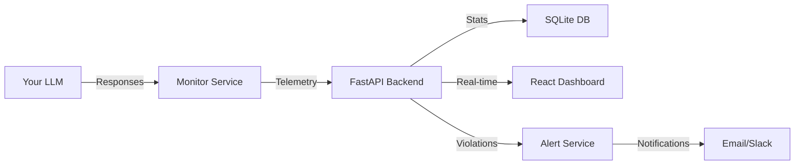

# 🔬 LLMscope

## Statistical Process Control for LLM Performance Monitoring

[](https://github.com/Blb3D/LLMscope/stargazers)
[](https://github.com/Blb3D/LLMscope/network)
[](./LICENSE-BSL.txt)
[](https://hub.docker.com/r/blb3d/llmscope)
[](http://makeapullrequest.com)

[🚀 Live Demo](https://demo.llmscope.io) | [📖 Documentation](./docs) | [� Contact](./CONTACT.md) | [🐛 Report Bug](https://github.com/Blb3D/LLMscope/issues)

## 🎯 Quick Access

After running `docker-compose up -d`:

- **🌐 Dashboard**: [http://localhost:8081](http://localhost:8081) - Main SPC monitoring interface
- **🔌 API**: [http://localhost:8000](http://localhost:8000) - Backend API endpoints  
- **📊 API Docs**: [http://localhost:8000/docs](http://localhost:8000/docs) - Interactive API documentation
- **🔑 API Key**: Set via `LLMSCOPE_API_KEY` environment variable

---

<div align="center">
  
  <br>
  <i>Detecting performance degradation 10 minutes before failure using Nelson Rules</i>
</div>

### 🎬 AI Copilot Demo Video

**Smart Fallback System in Action** (3 minutes - full workflow)

[](docs/assets/demos/ai-copilot-demo-smart-fallback.mp4)

See the complete AI workflow: violation detection → intelligent analysis → direct resolution. Features smart model detection, professional explanations, and seamless fallback from llama3.2:3b to 1b.

---

## 🚨 The Problem

**Your LLM is failing silently.** Traditional monitoring only tells you AFTER it crashes. By then, users are angry and damage is done.

- ❌ **Random latency spikes** with no warning
- ❌ **Gradual performance degradation** goes unnoticed  
- ❌ **Alert fatigue** from dumb threshold-based monitoring
- ❌ **No statistical rigor** in existing LLM tools

## ✨ The Solution: Manufacturing-Grade Quality Control for AI

LLMscope brings **50 years of proven Statistical Process Control (SPC)** from manufacturing to LLM monitoring. The same math that keeps airplane parts from failing now protects your AI infrastructure.

### 🎯 Key Features

- **🧠 AI Copilot** - Intelligent violation analysis powered by Ollama:
  - **Smart Model Fallback** - Works with any available model (llama3.2:1b, 3b, etc.)
  - **3 Explanation Types** - Technical, Business, and Remediation perspectives
  - **Zero Setup** - Automatically detects and uses your Ollama models
  - **Professional Analysis** - Root cause analysis and actionable remediation steps

- **📊 Nelson Rules Detection** - 8 statistical patterns that catch issues early:
  - R1: Points beyond 3σ (immediate issues)
  - R2: 9+ points on same side (process shift)
  - R3: 6+ trending points (degradation)
  - ...and 5 more advanced patterns

- **⚡ Real-Time Monitoring** - Sub-second latency tracking with beautiful visualizations

- **🔔 Smart Alerts** - Email/Slack notifications with context, not just "threshold exceeded"

- **🏠 Self-Hosted** - Your data never leaves your infrastructure (SOC2/HIPAA friendly)

- **🔌 Universal Support** - Works with Ollama, OpenAI, Anthropic, Cohere, and any LLM API

## 🚀 Quick Start (2 minutes)

### Option 1: One-Line Install (Recommended)

```bash
curl -sSL https://raw.githubusercontent.com/Blb3D/LLMscope/main/install.sh | bash
```

### Option 2: Docker Compose

```bash
# Clone the repository
git clone https://github.com/Blb3D/LLMscope.git
cd LLMscope

# Start the stack
docker-compose up -d

# Open your browser
open http://localhost:8081
```

### 🧠 AI Copilot Setup (Optional but Recommended)

For intelligent violation analysis, install Ollama:

```bash
# Install Ollama
curl -fsSL https://ollama.com/install.sh | sh

# Download a model (pick one):
ollama pull llama3.2:3b    # Best quality (2GB)
ollama pull llama3.2:1b    # Faster, smaller (1.3GB)

# LLMscope will auto-detect and use any available model!
```

**Note**: AI Copilot works with smart fallback - if you have `llama3.2:1b`, it uses that. If you upgrade to `llama3.2:3b`, it automatically switches. Zero configuration required!

### Option 3: Manual Setup

```bash
# Backend API
cd backend && pip install -r requirements.txt
python app.py

# Frontend (separate terminal)
cd frontend && npm install
npm run dev

# Monitor service (separate terminal)
cd monitor && python monitor_apis.py
```

## 📊 What Makes LLMscope Different?

<table>
<tr>
<th>Feature</th>
<th>LLMscope</th>
<th>Langfuse</th>
<th>DataDog</th>
<th>Helicone</th>
</tr>
<tr>
<td><b>AI Copilot Analysis</b></td>
<td>✅ Ollama-powered</td>
<td>❌</td>
<td>❌</td>
<td>❌</td>
</tr>
<tr>
<td><b>Statistical Process Control</b></td>
<td>✅ Full SPC</td>
<td>❌</td>
<td>❌</td>
<td>❌</td>
</tr>
<tr>
<td><b>Nelson Rules (8 patterns)</b></td>
<td>✅</td>
<td>❌</td>
<td>❌</td>
<td>❌</td>
</tr>
<tr>
<td><b>Predictive Detection</b></td>
<td>✅ 10min early</td>
<td>❌</td>
<td>Limited</td>
<td>❌</td>
</tr>
<tr>
<td><b>Smart Model Fallback</b></td>
<td>✅ Auto-detects</td>
<td>❌</td>
<td>❌</td>
<td>❌</td>
</tr>
<tr>
<td><b>Self-Hosted Option</b></td>
<td>✅</td>
<td>✅</td>
<td>❌</td>
<td>❌</td>
</tr>
<tr>
<td><b>Pricing</b></td>
<td>Free (self-hosted)</td>
<td>$59/mo (100k events)</td>
<td>$$$$ usage-based</td>
<td>$39/mo (100k logs)</td>
</tr>
</table>

## 🎬 See It In Action

### Real Violation Detection

<!-- Future: Add violation detection GIF -->


In this real test, LLMscope detected a "cognitive load spike" pattern 10 minutes before Ollama would have crashed, allowing automatic intervention.

### Dashboard Views
<!-- markdownlint-disable MD033 -->
<div align="center">


</div>
<!-- markdownlint-enable MD033 -->

## 🏗️ Architecture



## 🛠️ Configuration

### Basic Configuration

```yaml
# config.yaml
monitor:
  interval: 2  # seconds between checks
  provider: ollama
  model: llama3.2
  
alerts:
  email:
    enabled: true
    smtp_server: smtp.gmail.com
    recipients: ["ops@company.com"]
  
  slack:
    enabled: true
    webhook_url: https://hooks.slack.com/services/YOUR/WEBHOOK

thresholds:
  latency_warn: 2.0  # seconds
  latency_critical: 5.0
```

## 📈 Proven Results

> "LLMscope caught a memory leak in our RAG pipeline that would have taken down production. The Nelson Rules detected the pattern 12 minutes before our traditional monitoring would have triggered."  
> — *DevOps Lead, YC Startup*

> "We reduced our P99 latency by 40% after LLMscope revealed hidden patterns in our model serving."  
> — *ML Engineer, Fortune 500*

## 🚦 Roadmap

### Current (v0.2.0)

- ✅ Real-time SPC monitoring
- ✅ Nelson Rules R1-R3
- ✅ Email/Slack alerts
- ✅ Multi-model support
- ✅ Docker deployment

### Coming Soon (v0.3.0 - Q1 2026)

- 🔄 Complete Nelson Rules (R4-R8)
- 🔄 Prometheus/Grafana integration
- 🔄 Cost analytics dashboard
- 🔄 Team collaboration features

### Future (v1.0.0 - 2026)

- 🔮 Manufacturing IoT monitoring
- 🔮 Predictive maintenance AI
- 🔮 Enterprise SSO/RBAC
- 🔮 Cloud SaaS offering

## 🤝 Contributing

We love contributions! See [CONTRIBUTING.md](./CONTRIBUTING.md) for guidelines.

### Quick Contribution Ideas

- Add support for your LLM provider
- Improve violation detection algorithms  
- Create custom dashboards
- Write documentation
- Report bugs

## 📜 License

LLMscope is licensed under the Business Source License 1.1. See [LICENSE](./LICENSE-BSL.txt) for details.

**TL;DR:** Free for production use, becomes MIT license in 2028. Commercial support available.

## 💬 Community & Support

- **Email**: <bbaker@blb3dprinting.com>
- **GitHub Issues**: [Report bugs](https://github.com/Blb3D/LLMscope/issues)
- **GitHub Discussions**: [Feature requests & questions](https://github.com/Blb3D/LLMscope/discussions)
- **LinkedIn**: [Professional profile coming soon]
- **Website**: [Domain registration in progress]

## 🙏 Acknowledgments

Built with inspiration from:

- Statistical Process Control pioneers (Shewhart, Deming, Nelson)
- The Ollama community
- Modern observability tools

## ⭐ Star History

[](https://star-history.com/#Blb3D/LLMscope&Date)

---

<div align="center">
  
**If LLMscope helps you catch issues before they impact users, please ⭐ star this repo!**

Made with ❤️ for the AI reliability community

[🚀 Get Started](https://github.com/Blb3D/LLMscope) | [📖 Read Docs](./docs) | [� Contact](./CONTACT.md)

</div>
