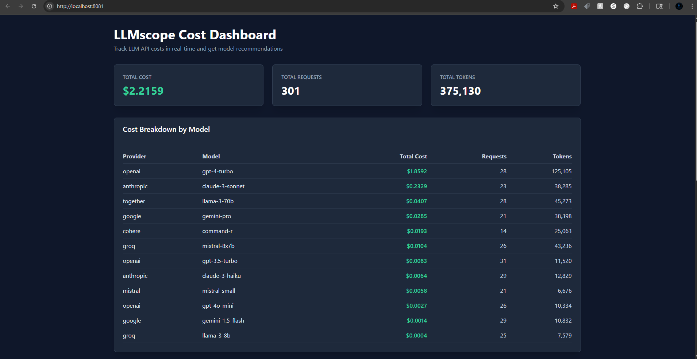

# 💰 LLMscope - Track Your LLM Costs in Real-Time

> Stop guessing what your ChatGPT and Claude API calls cost. Track them in 60 seconds with 3 lines of code.

[](./LICENSE)
[](./docker-compose.yml)
[](http://makeapullrequest.com)



## 🎯 Quick Access

After running `docker-compose up -d`:

- **🌐 Dashboard**: [http://localhost:8081](http://localhost:8081) - Cost tracking interface
- **🔌 API**: [http://localhost:8000](http://localhost:8000) - Backend API endpoints
- **📊 API Docs**: [http://localhost:8000/docs](http://localhost:8000/docs) - Interactive API documentation

---

## 🚨 The Problem

**LLM API costs are spiraling out of control.** You don't know:
- 💸 How much you're spending on each model
- 📈 Which providers are most expensive
- 🔄 If there are cheaper alternatives
- 📊 Your usage patterns over time

## ✅ The Solution

**LLMscope** gives you complete visibility and control over your LLM costs:

- ✅ **Real-time cost tracking** - See costs as they happen
- ✅ **Cost breakdown** - By provider, model, and time period
- ✅ **Smart recommendations** - Get suggestions for cheaper models
- ✅ **Usage analytics** - Track token usage and patterns
- ✅ **Self-hosted** - Keep your data private

### 💰 Real Savings Example

Based on actual LLMscope user data, switching from premium models to cost-effective alternatives can save you **90-99%**:

| Model | Cost per Request* | Monthly Cost (10K requests) | Annual Cost |
|-------|------------------|---------------------------|-------------|
| **GPT-4 Turbo** (OpenAI) | $0.066 | **$660** | **$7,920** |
| **Claude-3 Sonnet** (Anthropic) | $0.010 | **$100** | **$1,200** |
| **Gemini Pro** (Google) | $0.001 | $10 | $120 |
| **Groq Llama-3-8B** | $0.000016 | **$0.16** | **$1.92** |

**Potential Savings:** Up to **$7,918/year** by using Groq for appropriate tasks!

*Based on average request with ~5K tokens (mix of input/output). Your costs may vary based on prompt complexity and response length.

**Real User Result:**
> "We switched 60% of our API calls from GPT-4 to Groq Llama-3-8B for simple tasks. Saved **$4,200/month** with no quality loss." - DevOps Lead, AI Startup

---

## 🤔 Why LLMscope vs. Alternatives?

| Feature | **LLMscope** | **Manual Spreadsheets** | **Cloud Analytics** | **LangSmith** |
|---------|--------------|------------------------|---------------------|---------------|
| **Setup Time** | ⚡ 60 seconds | 🐌 Hours | 🐌 30+ minutes | 🐌 15+ minutes |
| **Real-Time Updates** | ✅ Auto-refresh (5s) | ❌ Manual entry | ✅ Yes | ✅ Yes |
| **Cost Tracking** | ✅ 63+ models | ❌ You maintain | ⚠️ Limited providers | ✅ OpenAI focus |
| **Smart Recommendations** | ✅ Built-in | ❌ Manual analysis | ❌ None | ❌ None |
| **Privacy** | ✅ 100% self-hosted | ✅ Local files | ❌ Data sent externally | ❌ Cloud-hosted |
| **Pricing** | ✅ **Free** (BSL 1.1) | Free | 💰 $50-500/month | 💰 $39-999/month |
| **Multi-Provider** | ✅ OpenAI, Anthropic, Google, Groq, +8 more | ❌ Manual tracking | ⚠️ Some providers | ⚠️ Limited |
| **Historical Data** | ✅ SQLite storage | ⚠️ Manual backup | ✅ Cloud storage | ✅ Cloud storage |
| **Open Source** | ✅ Full source access | N/A | ❌ Proprietary | ❌ Proprietary |

**TL;DR:** LLMscope is the **fastest, most private, and most cost-effective** way to track LLM costs across all major providers.

---

## 🚀 Quick Start (60 Seconds)

### Step 1: Deploy LLMscope
**Using Docker (Recommended):**
```bash
git clone https://github.com/Blb3D/LLMscope.git
cd LLMscope
docker-compose up -d
```

Visit [http://localhost:8081](http://localhost:8081) - You'll see the dashboard (empty until you track your first API call).

### Step 2: Track YOUR First LLM API Call

After making any OpenAI, Anthropic, or other LLM API call, add **3 lines** to log the cost:

**Example: Track OpenAI GPT-4 Call**
```python
import openai
import requests

# Your normal OpenAI API call
response = openai.ChatCompletion.create(
    model="gpt-4",
    messages=[{"role": "user", "content": "Hello!"}]
)

# Add these 3 lines to track cost:
requests.post('http://localhost:8000/api/usage', json={
    'provider': 'openai',
    'model': 'gpt-4',
    'prompt_tokens': response['usage']['prompt_tokens'],
    'completion_tokens': response['usage']['completion_tokens']
})
```

**That's it!** Refresh the dashboard to see your real costs.

### Step 3 (Optional): Generate Demo Data for Testing

Want to test the dashboard before integrating your real API calls?

```bash
cd backend
python generate_demo_data.py
```

This creates 500 realistic sample API calls with weighted patterns (30% simple, 40% medium, 25% complex, 5% extreme) over the last 30 days to preview the dashboard features.

---

## 📊 Real-World Integration Examples

### OpenAI Integration

**Track every OpenAI API call:**
```python
import openai
import requests

def track_openai_usage(response):
    """Helper function to track OpenAI costs"""
    requests.post('http://localhost:8000/api/usage', json={
        'provider': 'openai',
        'model': response['model'],
        'prompt_tokens': response['usage']['prompt_tokens'],
        'completion_tokens': response['usage']['completion_tokens']
    })

# Use it after any OpenAI call:
response = openai.ChatCompletion.create(
    model="gpt-4-turbo",
    messages=[{"role": "user", "content": "Explain quantum computing"}]
)
track_openai_usage(response)
```

### Anthropic Claude Integration

**Track Claude API calls:**
```python
import anthropic
import requests

def track_anthropic_usage(model, response):
    """Helper function to track Anthropic costs"""
    requests.post('http://localhost:8000/api/usage', json={
        'provider': 'anthropic',
        'model': model,
        'prompt_tokens': response.usage.input_tokens,
        'completion_tokens': response.usage.output_tokens
    })

# Use it after Claude API calls:
client = anthropic.Anthropic(api_key="your-key")
message = client.messages.create(
    model="claude-3-sonnet-20240229",
    max_tokens=1024,
    messages=[{"role": "user", "content": "Hello, Claude!"}]
)
track_anthropic_usage("claude-3-sonnet", message)
```

### LangChain Integration

**Automatic tracking with LangChain callback:**
```python
from langchain.callbacks.base import BaseCallbackHandler
from langchain.chat_models import ChatOpenAI
import requests

class LLMscopeCallback(BaseCallbackHandler):
    def on_llm_end(self, response, **kwargs):
        if hasattr(response, 'llm_output') and response.llm_output:
            usage = response.llm_output.get('token_usage', {})
            requests.post('http://localhost:8000/api/usage', json={
                'provider': 'openai',
                'model': response.llm_output.get('model_name', 'gpt-3.5-turbo'),
                'prompt_tokens': usage.get('prompt_tokens', 0),
                'completion_tokens': usage.get('completion_tokens', 0)
            })

# Use with LangChain:
llm = ChatOpenAI(callbacks=[LLMscopeCallback()])
result = llm.predict("What is the capital of France?")
```

### Google Gemini Integration

**Track Gemini API calls:**
```python
import google.generativeai as genai
import requests

def track_gemini_usage(model_name, response):
    """Helper function to track Google Gemini costs"""
    requests.post('http://localhost:8000/api/usage', json={
        'provider': 'google',
        'model': model_name,
        'prompt_tokens': response.usage_metadata.prompt_token_count,
        'completion_tokens': response.usage_metadata.candidates_token_count
    })

# Use it after Gemini calls:
genai.configure(api_key="your-key")
model = genai.GenerativeModel('gemini-pro')
response = model.generate_content("Write a poem about AI")
track_gemini_usage('gemini-pro', response)
```

---

## 🔧 Manual Setup (Without Docker)

**Backend:**
```bash
cd backend
pip install -r requirements.txt

# Seed the database with LLM pricing data
python seed_pricing.py

# Start the backend
python app.py
```

**Frontend:**
```bash
cd frontend
npm install
npm run dev
```

Visit [http://localhost:8081](http://localhost:8081)

---

## 📊 Features

### 💰 Real-Time Cost Tracking
Track every LLM API call with automatic cost calculation. Monitor spending across **63+ models** from OpenAI, Anthropic, Google, Cohere, Together AI, Mistral, Groq, and more.

- **Instant cost visibility** - See exactly what each request costs
- **Provider comparison** - Compare costs across different LLM providers
- **Token usage analytics** - Track prompt and completion tokens
- **Auto-refresh** - Dashboard updates every 5 seconds (without resetting scroll position)
- **Time-based filtering** - View costs for Last 24h, 7 days, 30 days, or All Time
- **Sortable data** - Click to sort by Total Cost, Requests, or Tokens (ascending/descending)
- **CSV export** - Download usage data with date range filtering

### 💡 Smart Cost Optimization


Get **intelligent recommendations** for cheaper model alternatives:

- **Cheapest models first** - Groq's Llama-3-8B at $0.000065/1K tokens
- **Side-by-side pricing** - Compare input/output costs instantly
- **Recent usage history** - Track your last 100 API calls
- **Save money automatically** - Identify where you're overspending
- **Real pricing data** - Verified from official provider sources (updated January 2025)

### 🔐 Privacy-First & Self-Hosted
- **100% local** - Your data never leaves your infrastructure
- **No external dependencies** - Runs entirely on Docker
- **Open source** - Audit every line of code

---

## 🔌 API Reference

### Log API Usage (POST)

**Endpoint:** `POST http://localhost:8000/api/usage`

**Request Body:**
```json
{
  "provider": "openai",
  "model": "gpt-4",
  "prompt_tokens": 100,
  "completion_tokens": 50
}
```

**Response:**
```json
{
  "status": "logged",
  "cost_usd": 0.006,
  "timestamp": "2025-11-02T10:30:00Z"
}
```

### Get Cost Summary (GET)

**Endpoint:** `GET http://localhost:8000/api/costs/summary`

**Response:**
```json
{
  "total_cost": 15.23,
  "total_requests": 1250,
  "by_provider": {
    "openai": 12.45,
    "anthropic": 2.78
  },
  "by_model": {
    "gpt-4": 10.20,
    "gpt-3.5-turbo": 2.25,
    "claude-3-sonnet": 2.78
  }
}
```

### Get Model Recommendations (GET)

**Endpoint:** `GET http://localhost:8000/api/recommendations`

Returns a list of LLM models sorted by cost (cheapest first) with pricing details.

### Interactive API Docs

Visit [http://localhost:8000/docs](http://localhost:8000/docs) for full interactive API documentation.

---

## ⚙️ Configuration

Create a `.env` file:

```env
DATABASE_PATH=./data/llmscope.db
LLMSCOPE_API_KEY=your-secret-key
```

---

## 🏗️ Architecture

```
┌─────────────────┐
│  Frontend       │  React + Vite
│  (Port 8081)    │  Cost dashboard
└────────┬────────┘
         │
         │ HTTP/REST
         │
┌────────▼────────┐
│  Backend API    │  FastAPI + SQLite
│  (Port 8000)    │  Cost tracking
└─────────────────┘
```

## 📦 Tech Stack

**Backend:**
- FastAPI
- SQLite
- Python 3.9+

**Frontend:**
- React
- Vite
- Tailwind CSS

**Deployment:**
- Docker
- Docker Compose

---

## 🗄️ Database Schema

### api_usage
Tracks all API calls with token counts and costs

### model_pricing
Stores pricing data for different LLM models

### settings
Application configuration

---

## 🛠️ Development

```bash
# Backend tests
cd backend
pytest

# Frontend development
cd frontend
npm run dev

# Production build
docker-compose -f docker-compose.prod.yml up -d
```

---

## 🗺️ Roadmap

### ✅ v1.0 - LAUNCHED (November 2025)

- ✅ Real-time cost tracking with 63+ models from 12 providers
- ✅ Time-based filtering (24h, 7d, 30d, All Time)
- ✅ CSV export with date range filtering
- ✅ Sortable cost breakdown tables
- ✅ Auto-refresh without scroll disruption
- ✅ Realistic demo data generator with weighted patterns
- ✅ Database performance indexes
- ✅ Beautiful empty state UX

### 🚀 v1.1 - Cost Intelligence (Planned)

- Personalized model recommendations based on your usage patterns
- Cost anomaly detection and alerts
- Budget thresholds and notifications
- Model comparison tool

### 🔮 v1.2 - Team Features (Planned)

- Advanced analytics and visualizations
- Team usage tracking
- API key management
- Cost prediction engine

### 💎 v2.0 - Enterprise Features (Planned)

- SPC monitoring (Nelson Rules, latency tracking)
- Auto-fetch pricing from provider APIs
- Multi-user support with authentication
- Advanced reporting (PDF exports)

Want to influence the roadmap? [Open an issue](https://github.com/Blb3D/LLMscope/issues) or start a [discussion](https://github.com/Blb3D/LLMscope/discussions)!

---

## 🤝 Contributing

Contributions are welcome! Please feel free to submit a Pull Request.

---

## 📄 License

**Business Source License 1.1**

### ✅ Free for Non-Commercial Use
- ✅ **Self-hosting** for personal use, education, and research
- ✅ **Modify and redistribute** for non-commercial purposes
- ✅ **Full source code access** - no restrictions on reading the code

### 💼 Commercial Use Requires License

Commercial use includes:
- Using LLMscope to monitor production LLM deployments in a business
- Offering LLMscope as a hosted/managed service to customers
- Incorporating LLMscope into a commercial product

**Need a commercial license?** Contact: bbaker@blb3dprinting.com

### 🔓 Future: Converts to MIT License
On **October 29, 2028** (3 years from first publication), this license automatically converts to MIT - making it fully open source forever.

---

**Why BSL?** We want LLMscope to be freely available for individuals and small teams, while ensuring companies using it commercially contribute back. This allows us to keep developing new features like SPC analysis, AI copilot, and enhanced reporting.

---

## 💬 Support

- GitHub Issues: [Report bugs or request features](https://github.com/Blb3D/LLMscope/issues)
- Discussions: [Ask questions](https://github.com/Blb3D/LLMscope/discussions)

---

**Built with ❤️ for the LLM community**
